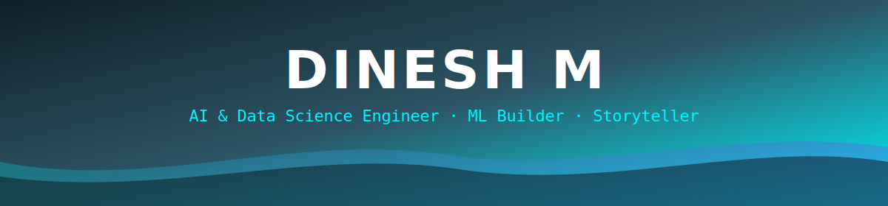

<div align="center">




<br/>

<a href="https://www.linkedin.com/in/dinesh-m-785047296"></a>
<a href="mailto:blacklordd985@gmail.com"></a>
<a href="https://github.com/DineshM2006"></a>


<br/><br/>

<a href="#-whoami">whoami</a> •
<a href="#️-tech-constellation">stack</a> •
<a href="#-featured-builds">builds</a> •
<a href="#-certifications">certs</a> •
<a href="#-live-analytics">analytics</a>

</div>


## 🧬 `whoami`

<table width="100%">
<tr>
<td width="60%" valign="top">

```python
class DineshM:
    def __init__(self):
        self.role      = "B.Tech AI & Data Science"
        self.college   = "Dhaanish Ahmed College of Engineering"
        self.gpa       = 8.96
        self.stack     = ["Python", "R", "SQL", "TensorFlow", "Power BI"]
        self.mission   = "Solve real problems with data + ML"

    def currently_building(self):
        return "🩺 ML models for healthcare risk prediction"

    def fun_fact(self):
        return "I debug faster with chai in hand ☕"

me = DineshM()
```

</td>
<td width="40%" valign="top">

### ⚡ Snapshot
- 🎓 `2023 – 2027` B.Tech AI & DS
- 🥇 SIH 2025 **Grand Finalist**
- 👑 Team Lead — Fraud Detection ML (Naan Mudhalvan)
- 🔬 Data Science & Data Analyst Intern @ NSIC
- 📢 Digital Marketing Intern @ APPROTECH
- 🌐 Tamil (Native) · English (Proficient) · Kannada (Intermediate)

</td>
</tr>
</table>


## 🛠️ Tech Constellation

<div align="center">


<br/><br/>


</div>


## 🚀 Featured Builds

<table width="100%">
<tr>
<td width="50%" valign="top">
<h3 align="center">🫁 Lung & Heart Cancer Risk Prediction</h3>
<p align="center">


</p>

> Predictive ML model trained on healthcare data to flag potential lung and heart cancer risk — built end-to-end from preprocessing to classification, achieving accurate and reliable predictions.

<p align="center"><i>Chennai, India · Mar 2026</i></p>

</td>
<td width="50%" valign="top">
<h3 align="center">🎁 Donate Deliver</h3>
<p align="center">


</p>

> Donation-management platform connecting donors ↔ beneficiaries, with integrated data tracking and optimized delivery workflows for timely, efficient resource distribution.

<p align="center"><i>Ongole, India · Presented at Smart India Hackathon 2025</i></p>

</td>
</tr>
<tr>
<td width="50%" valign="top">
<h3 align="center">💳 Credit Card Fraud Detection</h3>
<p align="center">


</p>

> Led a team (Naan Mudhalvan) to build a credit card fraud detection model — owned task distribution and ensured accurate, on-time delivery.

</td>
<td width="50%" valign="top">
<h3 align="center">🏆 More on the way</h3>
<p align="center">

</p>

> Currently building ML models for healthcare risk prediction — check back soon, or explore all repos below.

</td>
</tr>
</table>


## 📜 Certifications

<div align="center">


<br/>


<br/>


</div>


## 📊 Live Analytics

<div align="center">


</div>

<div align="center">

</div>

<div align="center">

</div>

<div align="center">

</div>

> 💡 *If a card above shows a blank/broken box on first load, just refresh — these are free, shared services (Vercel) that occasionally cold-start slowly.*


## 🐍 Contribution Snake (animated)

<div align="center">

</div>

> ⚠️ **One-time setup needed for this row only.** It requires a small GitHub Action ([Platane/snk](https://github.com/Platane/snk)) running in your `DineshM2006/DineshM2006` repo to generate the SVG. Everything else in this README works with zero setup — ask me for the workflow file + steps if you want this piece live too.


<div align="center"><i>✨ "Turning data into decisions, one model at a time." ✨</i></div>
